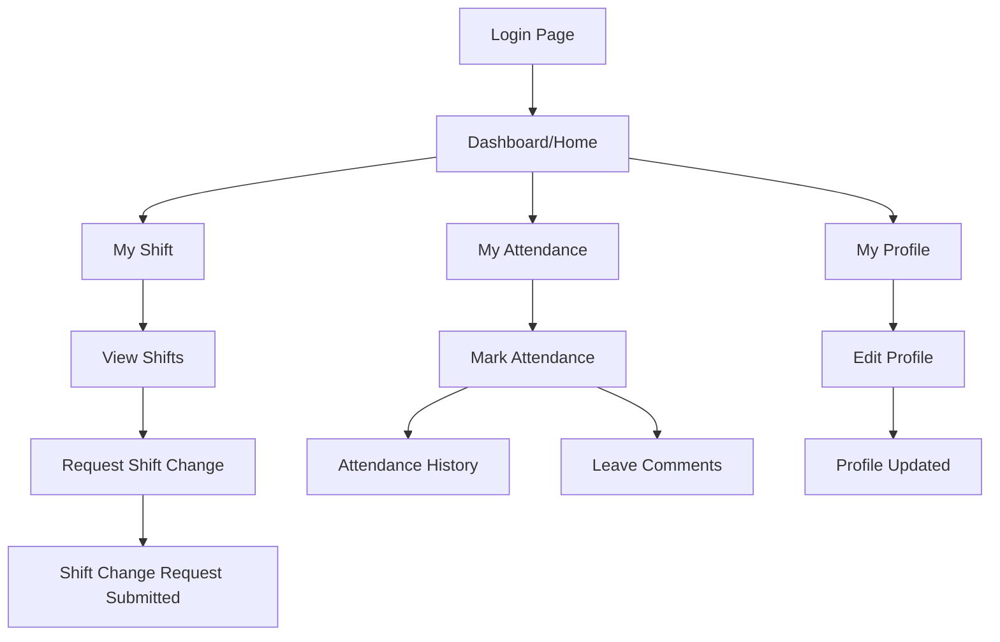
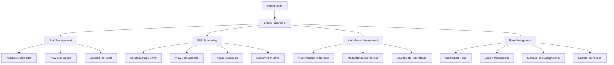
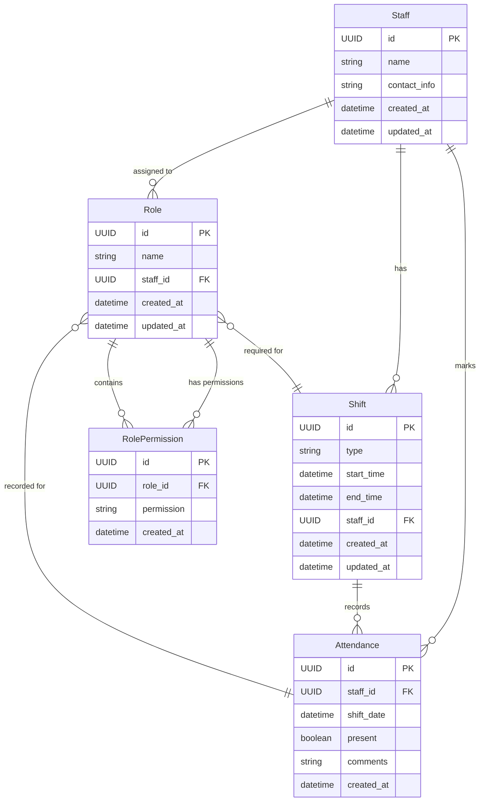

# Project Plan for Healthcare Staff Scheduling System : TEAM 5 Full Stack

## Team Members:

- Abdul Zelani
- Swikrit Shivhare
- Aman Chhabra

## Project Overview:

The Healthcare Staff Scheduling System is designed to optimize the scheduling of healthcare staff in a hospital setting. The system will allow for efficient management of staff schedules, ensuring that all shifts are covered while considering staff preferences and availability and tracking their working hours.

## Project Phases:

1. **Sprint 0**: Team formation, project setup, and initial planning.
2. **Sprint 1**: Parallel development of the user interface and backend services, including database setup and API development.
3. **Sprint 2**: CI/CD pipeline setup, deployment and demonstration of the system.


## System Requirements:

- **Functional Requirements**:
    1. Login and authentication for staff members.
    2. Staff List Management:
        - Add, edit, and delete staff members (With fields like name, id, role (Nurse, Doctor, Technician), contact information).
        - View staff details.
        - Shift Management: (Eg: Morning, Evening, Night)
            - Assign shifts to staff members.
            - View and edit shift assignments.
            - Track working hours for each staff member.
            - Shift Conflicts resolution (e.g., overlapping shifts).
    3. Shift Scheduling:
        - Create and manage shifts for different roles with configurable parameters (e.g., shift duration, break times).
        - Assign shifts based on staff availability and preferences.
        - Display shift schedules in a user-friendly format (e.g., calendar view).
        - Daily and weekly views of shifts.
        - Real time slot tracking of staff availability.
    4. Daily Schedule View:
        - View daily schedules for all staff members.
        - Highlight staff members who are on duty with different colors based on their roles and slots.
        - Allow for quick adjustments to schedules.
    5. Mark Attendance:
        - Staff members can mark their attendance for each shift.
        - Track attendance history for each staff member.
        - Leave comments or notes for each attendance entry.
    6. Search and Filter:
        - Search staff members by name, role, or ID.
        - Filter staff members based on their roles or availability.
        - Search shifts by date, staff member, or role.
    7. Shift Conflict Resolution:
        - Identify and resolve conflicts in shift assignments.
        - Notify staff members of any changes to their schedules.
        - Allow staff members to request shift swaps or changes.
    8. Department Management:
        - Manage departments within the hospital (e.g., Cardiology, Neurology).
        - Assign staff members to specific departments.
        - View department-wise staff distribution.

- **Non-Functional Requirements**:
    1. Performance:
        - The system should handle up to 1000 staff members and 5000 shifts without performance degradation.
        - Response time for any action should be less than 2 seconds.
    2. Security:
        - Implement role-based access control (RBAC) for different user roles (Admin, Staff).
        - Ensure data encryption for sensitive information (e.g., personal details, shift assignments).
    3. Usability:
        - The user interface should be intuitive and easy to navigate.
        - Provide help documentation and tooltips for users.
    4. Scalability:
        - The system should be designed to accommodate future growth in the number of staff members and shifts.

## Design Considerations and technical stack:

- **Frontend**: React.js for building a responsive and interactive user interface.
- **Backend**: Django for handling business logic and API development while providing a robust framework for the application.
- **Database**: We are using PostgreSQL for storing staff and shift data, ensuring data integrity and efficient querying.
- **Deployment**: Docker for containerization, allowing for easy deployment and scaling of the application.
- **CI/CD**: GitHub Actions for continuous integration and deployment, automating the testing and deployment process.
- **Version Control**: Git for source code management, enabling collaboration and version tracking.
- **Deployment Platform**: GCP for hosting the application, providing scalability and reliability.

### Frontend:

- **React.js**: For building the user interface, ensuring a responsive and dynamic experience.
- **Redux**: For state management, allowing for efficient data handling across components.
- **Axios**: For making API calls to the backend, ensuring smooth communication between frontend and backend.
- **Material-UI**: For pre-built components and styling, ensuring a consistent and modern look.

### Backend:

- **Django**: For building the backend services, providing a robust framework for handling requests and managing data.
- **Django REST Framework**: For building RESTful APIs, allowing the frontend to interact with the backend seamlessly.
- **PostgreSQL**: For the database, ensuring data integrity and efficient querying.
- **Docker**: For containerization, allowing for easy deployment and scaling of the application.
- **GitHub Actions**: For CI/CD, automating the testing and deployment process.
- **GCP**: For hosting the application, providing scalability and reliability.
- **Swagger**: For API documentation, making it easier for frontend developers to understand and use the backend APIs.

## Components and flow diagram:

- **Client Screen**: The user interface where staff members can interact with the system.
    1. **Login Page**: For authentication.
    2. **Dashboard or Home Page**: Displays the daily schedule and allows for quick access to staff management and shift scheduling.
    3. **My Attendance Page**: Where staff can mark their attendance and view their history.
    4. **My Profile**: Where staff can view and edit their personal information, including contact details and role.
    5. **My Shift**: Where staff can view their assigned shifts, request changes, and see their working hours.

- **Admin Screen**: The interface for administrators to manage the system.
    1. **Admin Dashboard**: Overview of the system, including staff statistics and shift assignments.
    2. **Staff Management**: Similar to the client screen but with additional administrative features.
    3. **Shift Scheduling**: For creating and managing shifts, viewing conflicts, and adjusting schedules.
    4. **Attendance Management**: For viewing and managing attendance records, including marking attendance for staff members.

### Frontend Flow Diagram:



### Admin Flow Diagram:


### Database Entities:


## API Endpoints Estimation:
```yaml
Staff:
  GET /api/staff/:
    description: Retrieve a list of all staff members.
  POST /api/staff/:
    description: Create a new staff member.
  GET /api/staff/{id}/:
    description: Retrieve details of a specific staff member.
  PUT /api/staff/{id}/:
    description: Update details of a specific staff member.
  DELETE /api/staff/{id}/:
    description: Delete a specific staff member.
Shift:
  GET /api/shifts/:
    description: Retrieve a list of all shifts.
  POST /api/shifts/:
    description: Create a new shift.
  GET /api/shifts/{id}/:
    description: Retrieve details of a specific shift.
  PUT /api/shifts/{id}/:
    description: Update details of a specific shift.
  DELETE /api/shifts/{id}/:
    description: Delete a specific shift.
Attendance:
  GET /api/attendance/:
    description: Retrieve a list of all attendance records.
  POST /api/attendance/:
    description: Mark attendance for a specific staff member.
  GET /api/attendance/{id}/:
    description: Retrieve details of a specific attendance record.
  PUT /api/attendance/{id}/:
    description: Update details of a specific attendance record.
  DELETE /api/attendance/{id}/:
    description: Delete a specific attendance record.
Role:
    GET /api/roles/:
        description: Retrieve a list of all roles.
    POST /api/roles/:
        description: Create a new role.
    GET /api/roles/{id}/:
        description: Retrieve details of a specific role.
    PUT /api/roles/{id}/:
        description: Update details of a specific role.
    DELETE /api/roles/{id}/:
        description: Delete a specific role.
RolePermission:
    GET /api/role-permissions/:
        description: Retrieve a list of all role permissions.
    POST /api/role-permissions/:
        description: Create a new role permission.
    GET /api/role-permissions/{id}/:
        description: Retrieve details of a specific role permission.
    PUT /api/role-permissions/{id}/:
        description: Update details of a specific role permission.
    DELETE /api/role-permissions/{id}/:
        description: Delete a specific role permission.
```

## Deployment Strategy:

- **Docker**: Containerize the application to ensure consistency across different environments.
- **GCP**: Deploy the application on GCP, utilizing services like Cloud Run or App Engine for the backend and Cloud Storage for static files.
- **CI/CD Pipeline**: Set up GitHub Actions to automate the build, test, and deployment processes, ensuring that changes are deployed quickly and reliably.
- **Monitoring and Logging**: Implement monitoring and logging using Observability tools like Prometheus and Grafana to track application performance and health or using OpenTelemetry based open source tools like Sentry or Signoz.

### Frontend Deployment:

- Using GCP Storage for serving the React application.
- Configure a CDN (Content Delivery Network) for faster content delivery and caching.

### Backend Deployment:

- Deploy the Django application on GCP using Cloud Run or App Engine.
- Use Cloud SQL for managing the PostgreSQL database.
- Cloud Storage for storing static files and media.

### Sprint 0:

- Team formation and role assignment.
- Project setup (repository creation, initial project structure).
- Initial planning and requirements gathering.


